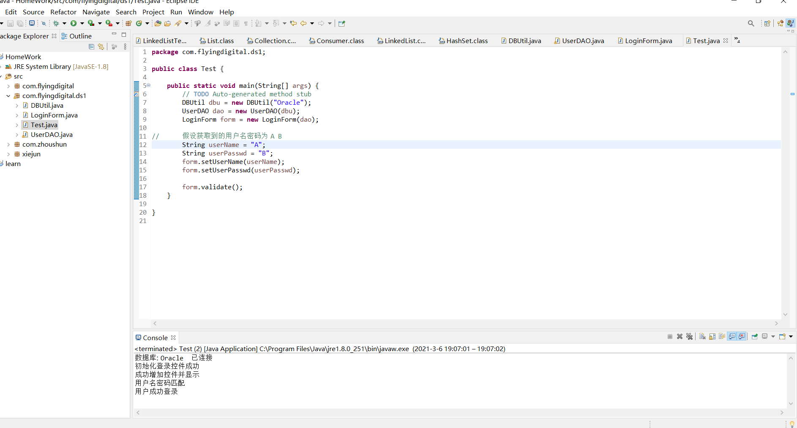

## 设计模式第一次作业

### 目标

根据提示重写`LoginForm`类，实现类的单一性原则。

重写的类只用实现单一性原则，具体的连接数据库可用print完成

### 原来的类

```
class Login{
	public static void init();
	public static void display();
	public static void validate();
	public static Connection getConnection();
	public static findUser(String userName,String userPasswd);
	public static void main(String args[]);
}
```

### 重写类的原型

```
// DBUtil	连接数据库
class DBUtil{
	public Connection getCoonection();
}
```

```
// UserDao  用户验证
class UserDao{
	private DBUtil db;
	public boolean findUser(String userName,String userPasswd);
}
```

```
// LoginForm   登录表单
class LoginForm{
	private UserDao dao;
	public void init();//初始化页面控件
	public void display();//添加并显示控件
	public void validate();//验证用户名密码
}
```

```
//MainClass 验证类
class MainClass{
	public static void main(String agrs[]);
}
```


### 运行结果



