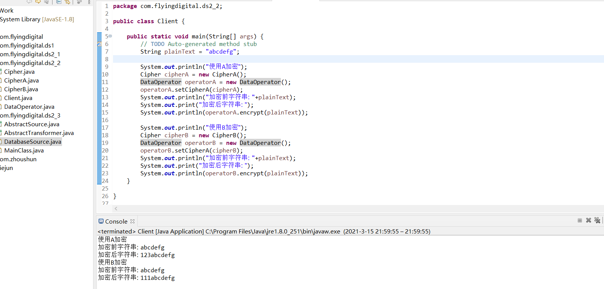

## 设计模式第二次作业第二个示例

### 目标

用不同的算法加密密码，使其易于扩展，整合原来的类，满足里氏替换原则。子类有的，父类都有。

### 思路

设计一个基类，使继承他的子类所有的方法都在基类存在。

### 原来的类

Client类(用来测试)

```
class Client{
	public static void main(String args[]);
}
```

DataOperactor类(用来设置加密算法并可对密码进行加密)

```
class DataOperactor{
	private CipherA cipherA;
	private CipherB cipherB;
	
	public void  SetCipherA(CipherA cipherA);
	public void  SetCipherB(CipherB cipherB);
	public String encrypt(String plainText);
}
```

CipherA类(加密算法A)

```
class CipherA{
	public String encrypt(String plainText);
}
```

CipherB类(加密算法B)

```
class CipherB{
	public String encrypt(String plainText);
}
```


### 重写类原型

Client类(用来测试)

```
class Client{
	public static void main(String args[]);
}
```

DataOperactor类(用来设置加密算法并可对密码进行加密)

```
class DataOperactor{
	private CipherA cipherA;
	
	public void  SetCipherA(CipherA cipherA);
	public String encrypt(String plainText);
}
```

CipherA类(加密算法A)

```
class CipherA{
	public String encrypt(String plainText);
}
```

CipherB类(加密算法B)

```
class CipherB extends CipherA{
	public String encrypt(String plainText);
}
```

### 运行结果



### 思考

由于书中例子给的CipherA为基类，由CipherB继承CilpherA，但是CipherB重写了CipherA的方法，从网上查找到的里氏替换原则中并不建议这么做，即子类重写或覆盖父类中的非抽象方法，不过子类却可以实现父类的非抽象方法，故我增加了一个Cipher类 设作基类，让其他的加密算法继承他，并实现自己的加密算法。

