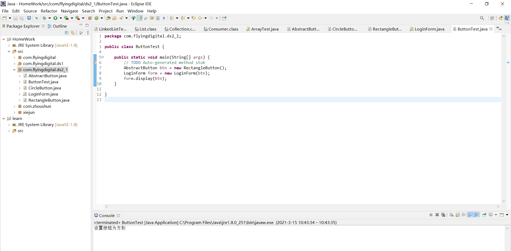
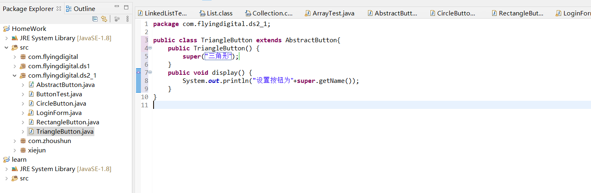
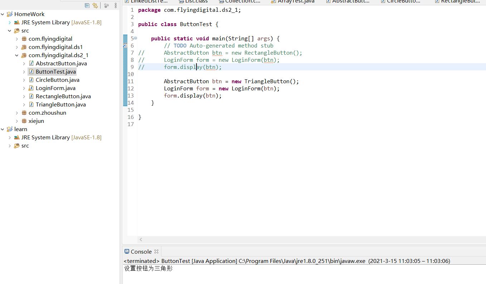

## 设计模式第二次作业第一个示例

### 目标

设计一个抽象按钮类，使LoginForm类可以任意更换按钮形状，且可以添加新按钮，要求满足开闭原则。

可拓展，不可修改。

### 思路

设计一个抽象的按钮类，子类的变量，方法抽象类最好都有(里氏替换)，具体的display由子类实现。

### 原来的类

LoginForm类(登录表单类, 圆形按钮)

```
public LoginForm{
	private CircleButton button;
	public void display();
}
```

LoginForm类(登录表单类, 方形按钮)

```
public LoginForm{
	private RectangleButton button;
	public void display();
}
```

CircleButton类(定义圆形按钮)

```
publid CircleButton{
	public void display();
}
```

RectangleButton类(定义方形按钮)

```
publid RectangleButton{
	public void display();
}
```

### 重写类原型

LoginForm类

```
public LoginForm{
	private AbstractButton button;
	public void display();
}
```

AbstractButton类(定义圆形按钮)

```
publid abstract AbstractButton{
	public abstract void display();
}
```

以下可任意添加按钮类，只需继承AbstractButton

CircleButton

```
publid CircleButton extends AbstractButton{
	public void display();
}
```

### 运行结果

添加按钮前



新增一个三角形按钮



最后运行结果

